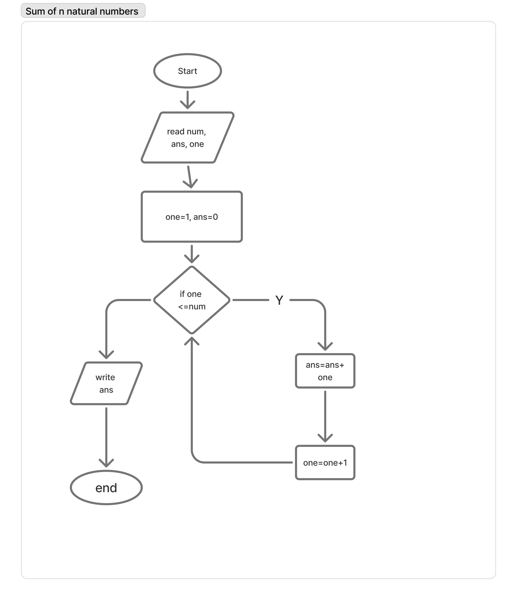

#  Logic Building Flowcharts

This folder contains **visual flowcharts** created to strengthen **logical thinking and problem-solving fundamentals**.  
Each flowchart demonstrates the step-by-step logic behind common programming problems.

---

##  Flowcharts Board
[View All Flowcharts on FigJam](https://www.figma.com/board/NH1WYMNzgBiSJfqbUKgSqY/flowcharts?node-id=0-1&p=f&t=JBuqfo296vpiJf09-0)

---

##  Problem Statements & Flowcharts

###  Greatest of 2
Find the greater number between two user inputs.  

---

###  Greatest of 3
Identify the largest number among three inputs.  

---

###  Greatest of 4
Determine the maximum value from four numbers.  

---

###  Natural Sum
Calculate the sum of the first **N** natural numbers.  

---

###  Factorial
Compute the factorial of a given number **N**.  

---

###  Alternating Series
Generate the series:  
`1, -2, 3, -4, 5, ...`  

---

###  Factorial Series
Print the pattern:  
`1!, -3!, 5!, -7!, ...`  

---

###  Number Series
Display the pattern:  
`1, 12, 123, 1234, ...`  

---

###  Palindrome Series
Generate palindromes such as:  
`1, 121, 12321, 1234321`  

---

###  Incrementing Palindrome
Print patterns like:  
`1, 232, 34543, 4567654, ...`  

---

###  Odd Fibonacci Sequence
Produce the pattern:  
`1 1 1 3 2 5 3 7 5 9 ...`  

---

###  Sine Series
Evaluate the series:  
`x − x³/3! + x⁵/5! − x⁷/7! + ...` up to **n** terms.  

---

   

